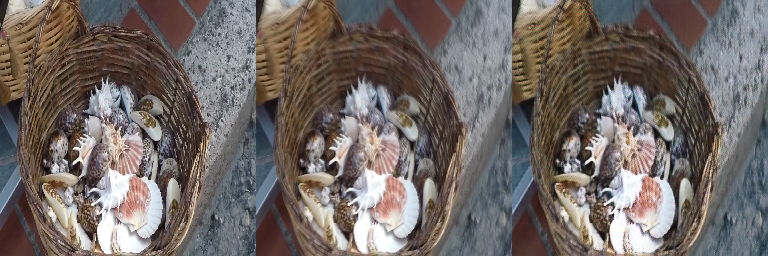

# APMAE4990 PROJECT - Deblur Images
+ **Projec Title**: Deblur Images   
  + Prensentation Slides: [E4990_Presentation.pdf](E4990_Presentation.pdf)  
  + Project Report：[main.ipynb](./code_ipynb/main.ipynb )    
  + Web App Demo：[https://youtu.be/F7ZUQMzH3nw](https://youtu.be/F7ZUQMzH3nw)   
+ **Group Members**:  
  + Yilin Lyu	(yl3832)
  + Yiyi Zhang (yz3280)
  + Liangliang Huang (lh2863)
  +  Shan Guan  (sg3506)
+ **Project Summary**:  
In this project, we have implemented two different methods for image deblurring using GAN, introduced in [DeblurGAN: Blind Motion Deblurring Using Conditional Adversarial Networks](https://arxiv.org/pdf/1711.07064.pdf). The [peak signal-to-noise ratio (PSNR)](https://en.wikipedia.org/wiki/Peak_signal-to-noise_ratio) metric then has been applied to evaluate the two models. As shown in the table below, the approach introduced in the first paper is better.    
.   
Below shows an example of the sharp, blurred, deblurred images (from left to right).    


**Contribution Statement**:
+ Yilin Lyu: Understanding the novel Deblur GAN model and implemented in Tensorflow, trained optimized and tested. 
+ Yiyi Zhang:  Model training testing and evaluating, hyperparameters searching, web application development. 
+ Liangliang Huang: Understanding the other basic GAN model for deblurring and implemented in Keras,  SQL utilization.    
+ Shan Guan: Understanding the other basic GAN model for deblurring and implemented in Keras ,SQL utilization.  

```
proj/
├── code_ipynb/  
├── figs/  
└── web_app/
```

Please see each subfolder for a README file.
